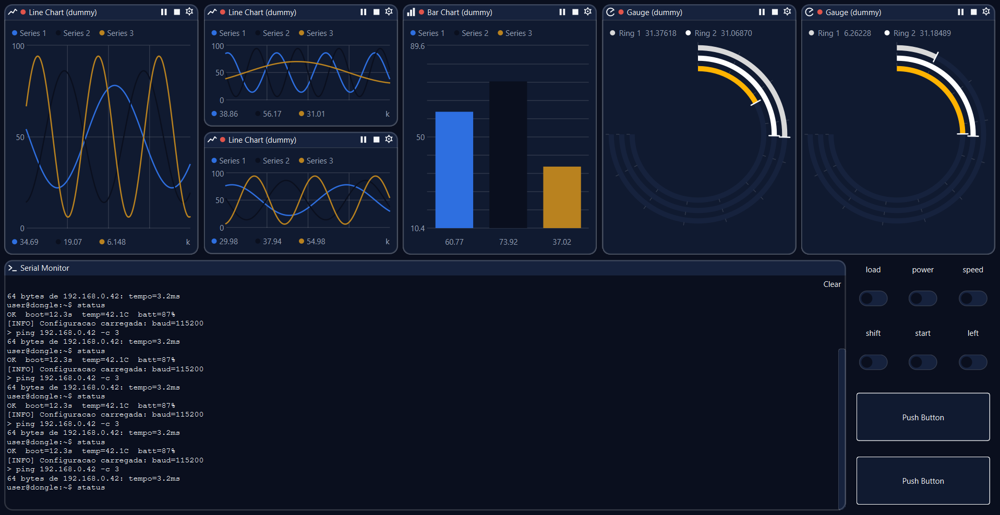

# TraceView

Real-time telemetry dashboard for ESP32/ESP-NOW robots, built with C++17
and Qt 6 Widgets for Windows and Linux.

## What it does

TraceView connects to BTP-compatible devices over serial or USB HID,
including robots reached through a Bally dongle acting as an ESP-NOW hub.
A `.tvproj` workspace stores device configuration and dashboard layouts.

- **Live dashboards** with charts, gauges, text boards and controls.
  Telemetry bindings select fields from the device's advertised catalog;
  widgets can be arranged, resized and configured per project.
- **Multiple devices** with independent connections, dashboard tabs and
  terminal routing. Hub children share a physical connection while keeping
  their own protocol sessions and recovery state.
- **Device scripts** executed by Qt's JavaScript engine, with callbacks for
  telemetry, terminal output, connection state, status and device info.
  Scripts can use timers and send commands or terminal input; the runtime
  remains active while its editor is closed.
- **Firmware upload over Wi-Fi** with per-device reachability, reported
  firmware version and upload progress in the OTA tab.
- **Logs and diagnostics** including a `.blog` event-log viewer, multi-tab
  serial monitor, BTP traffic inspection and notification history.
- **Application preferences** for rendering, terminals, connections,
  diagnostics, themes, fonts and translated UI text.

## How it works

A `DeviceConnection` combines transport handling with a `Backend` for one
device. The transport moves bytes; `BtpBackend` implements BTP session
setup, manifest discovery, subscriptions and telemetry decoding. The
backend exposes decoded samples and connection information to the UI
through the contract in [lib/backend/backend.h](lib/backend/backend.h).

The device manifest describes available topics and fields. Dashboard
bindings identify the source, topic, field and array element to consume.
The subscription manager aggregates consumers per topic and manages their
requested rates; incoming samples feed the widgets' telemetry buffers.
The display render rate is separate from the device's telemetry rate.

For a hub child, TraceView routes BTP frames through the parent's connection
and maintains a separate backend/session for that robot. Channel sealing
protects the child's end-to-end traffic; the dongle relays the sealed
payload. Hub presence information and robot session state support child
recovery without treating every robot as the same connection.

Firmware OTA uses a separate HTTP connection over Wi-Fi: `GET /status`
checks the robot and `POST /update` uploads the binary. Firmware images do
not travel through the BTP telemetry connection. Application self-updates
use GitHub Releases and are separate from robot firmware updates.

## Getting started

1. Install a packaged build from the
   [Releases page](https://github.com/AlisonTristao/TraceView/releases), or
   follow [Building from source](CONTRIBUTING.md#building-from-source).
2. Create a project or open [example.tvproj](example.tvproj) to inspect an
   existing layout. Live data requires matching devices and configuration.
3. Add a device and configure its serial port or USB HID connection. For a
   robot behind a hub, configure the parent device and the child's hub
   channel/identity according to [Devices and hubs](docs/DEVICES.md).
4. Connect the device and wait for session setup and manifest discovery.
   Select the advertised telemetry fields in the widget properties.
5. Open the **Layout** tab, use **Add**, and edit each widget's
   type, properties, position and size. Switch to **Run** to operate the
   dashboard, then save the workspace as a `.tvproj` file.
6. For firmware upload, configure the device's OTA address, open
   **File > Upload Firmware (OTA)...**, check reachability and select the
   firmware binary. See [OTA procedures](docs/OTA.md) for passwords, mDNS
   resolution and upload behavior.

## Download and application updates

The release workflow produces these x64 packages:

| Platform | Package | Runtime requirements |
|---|---|---|
| Windows | `TraceView-<version>-windows-x64.exe` NSIS installer | Bundles Qt and MinGW runtime libraries. |
| Linux | `TraceView-<version>-linux-x64.tar.gz` | Bundles Qt, plugins and collected third-party dependencies; requires compatible glibc and the desktop X11/Wayland/GL stack. |

On Linux, extract the complete archive and run `bin/TraceView` inside the
extracted directory. Keep its sibling `lib/` and `plugins/` directories.
Serial and HID access also require the operating system's device permissions.

TraceView checks for an application update at startup, at most once a day,
and from **Settings > Updates**. Installation requires **Update Now**.
The current release workflow marks builds as prereleases, and the updater
includes those releases when checking for a newer version. Packages are
published with `SHA256SUMS.txt`.

## Technical documentation

| Document | Contents |
|---|---|
| [Contributing](CONTRIBUTING.md) | Dependencies, build/test commands, branch conventions and release procedure. |
| [Devices and hubs](docs/DEVICES.md) | Device model, connections and hub/child contract. |
| [Protocol](docs/PROTOCOL.md) | TraceView's BTP integration and wire-format references. |
| [Dashboard](docs/DASHBOARD.md) | Layout model, widget editing and persistence. |
| [OTA](docs/OTA.md) | Firmware upload, status polling, credentials and mDNS. |
| [Ecosystem](docs/ECOSYSTEM.md) | Boundaries between TraceView, BTP and Bally firmware. |
| [Theming](docs/THEMING.md) | Theme implementation and extension points. |
| [Changelog](CHANGELOG.md) | Changes by release. |

The shared protocol implementation is maintained in
[BTP](https://github.com/AlisonTristao/BTP) and fetched at the revision pinned
in `CMakeLists.txt`.

## License

[MIT](LICENSE)
