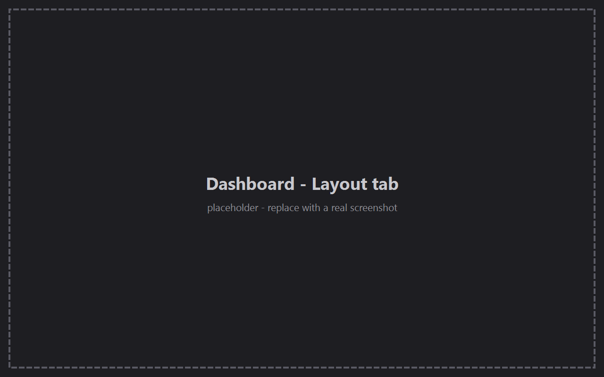
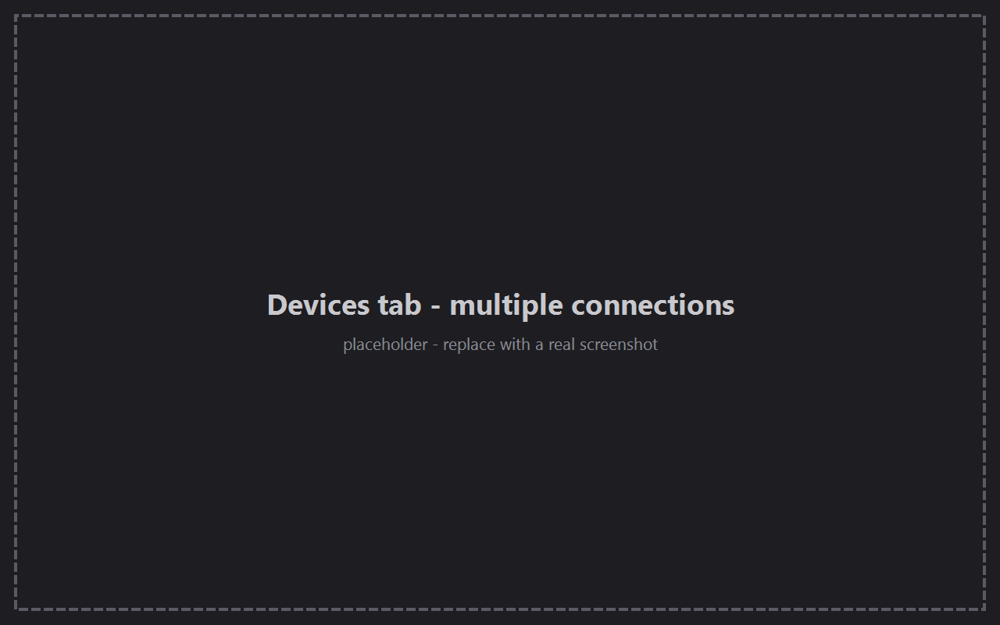

# TraceView

Real-time telemetry dashboard for ESP32/ESP-NOW robots, built in C++ with Qt.

> **Status:** v2.1.0 — the dashboard now manages multiple independently-connected devices side by side, on top of the workspaces/theming/docking round from 2.0.0. The BTP telemetry integration behind it is still evolving. See [CONTRIBUTING.md](CONTRIBUTING.md) for the branching/feature workflow and [docs/ECOSYSTEM.md](docs/ECOSYSTEM.md) for how this project fits with the rest of the Bally ecosystem.

## Screenshots

| Dashboard | Devices |
|---|---|
|  |  |

## What's new in 2.1.0

- **Devices tab** — devices are their own managed list now (name, connection
  config, live status dot), instead of one port/baud pair for the whole
  project. See [docs/DEVICES.md](docs/DEVICES.md).
- **Multiple simultaneous connections** — each device opens its own
  independent BTP session and reconnects on its own in the background, so
  several robots/boards can be live at once.
- **Per-widget device targeting** — every chart, gauge, control, and the
  serial monitor picks which device it listens to; there's no single
  "active device" for a project anymore.
- Devices tab undo/redo, and **Ctrl+Tab**/**Ctrl+Shift+Tab** to cycle
  workspaces from anywhere.

See [CHANGELOG.md](CHANGELOG.md) for the full list, including every prior release.

## Architecture: the UI doesn't know about BTP

TraceView ships wired to [BTP](https://github.com/AlisonTristao/BTP) by
default, but the dashboard/UI layer (`traceview_dashboard`, `traceview_ui`)
never talks to BTP directly. Everything that gives meaning to the bytes
coming off the wire — decoding telemetry samples, tracking topic
subscriptions, framing terminal input/output — sits behind one abstract
interface:

```
lib/backend/backend.h   -> class Backend (the interface)
lib/protocol/btpbackend.h/.cpp -> class BtpBackend : public Backend (the BTP implementation)
lib/telemetry/          -> generic value types Backend's API is expressed in
                            (TelemetryFieldBinding, TopicSubscriptionState,
                            StatusTopicRecord, TelemetrySeriesBuffer) — no
                            BTP dependency
```

`core/serialmanager.h` (`SerialManager`) stays a concrete piece with a
narrow job: it only moves raw bytes in and out of one open serial port,
nothing more. `Backend` is the layer above it, fed raw bytes (`feedBytes()`)
and connection state (`onTransportConnectionChanged()`), driving the
dashboard through its signals (`fieldSample`, `subscriptionsChanged`,
`terminalDataReceived`, ...) — see `lib/backend/backend.h` for the full
contract. `core/deviceconnection.h` (`DeviceConnection`) pairs one
`SerialManager` with one `Backend` per configured device
(see [docs/DEVICES.md](docs/DEVICES.md)), so `MainWindow` can hold several
devices open and decoding independently at once instead of one shared
connection for the whole project.

This means a different protocol can be plugged in by implementing `Backend`
and constructing it in place of `BtpBackend` in `MainWindow`'s constructor —
nothing else in the UI/dashboard layer needs to change. A from-scratch
`Backend` implementation depends only on `traceview_backend` and
`traceview_telemetry` (both plain `Qt6::Core`, no BTP dependency), never on
`traceview_protocol`.

This boundary is still young — the interface will keep moving as more of
the protocol gets built out, and only BTP has a real implementation behind
it today.

## Build

Requirements: CMake >= 3.21, Qt6 (Widgets, SerialPort), a C++17 compiler.

```sh
cmake -B build -S .
cmake --build build
```

If Qt6 isn't auto-discovered (e.g. a Qt Online Installer setup on Windows),
point CMake at the kit explicitly:

```sh
cmake -B build -S . -G Ninja -DCMAKE_PREFIX_PATH="C:/Qt/6.9.2/mingw_64"
cmake --build build
```

## License

[MIT](LICENSE)
