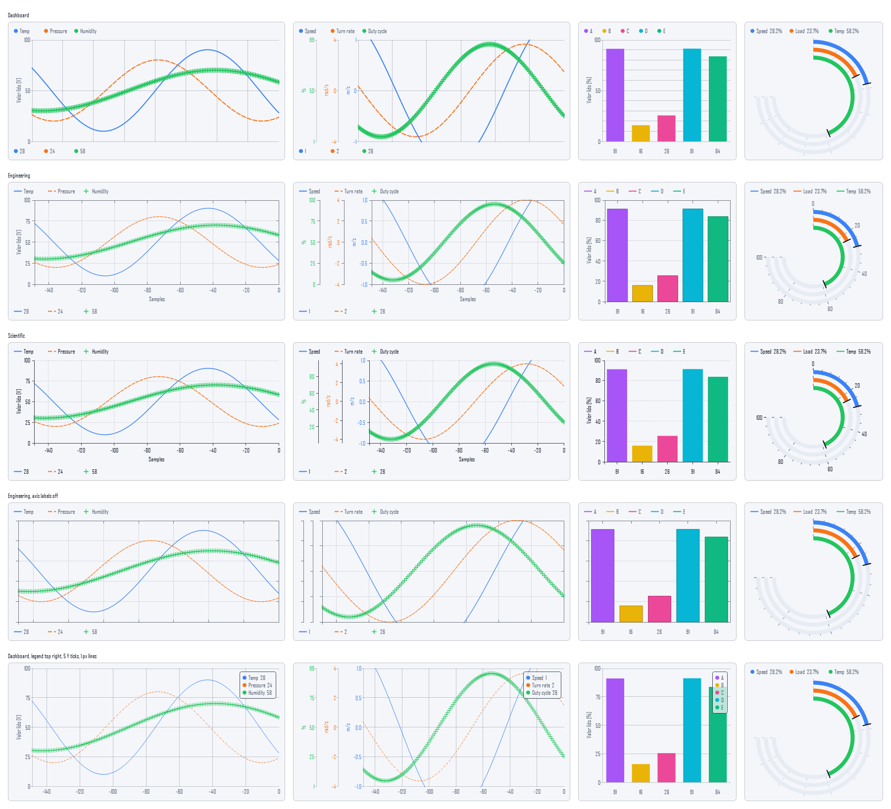
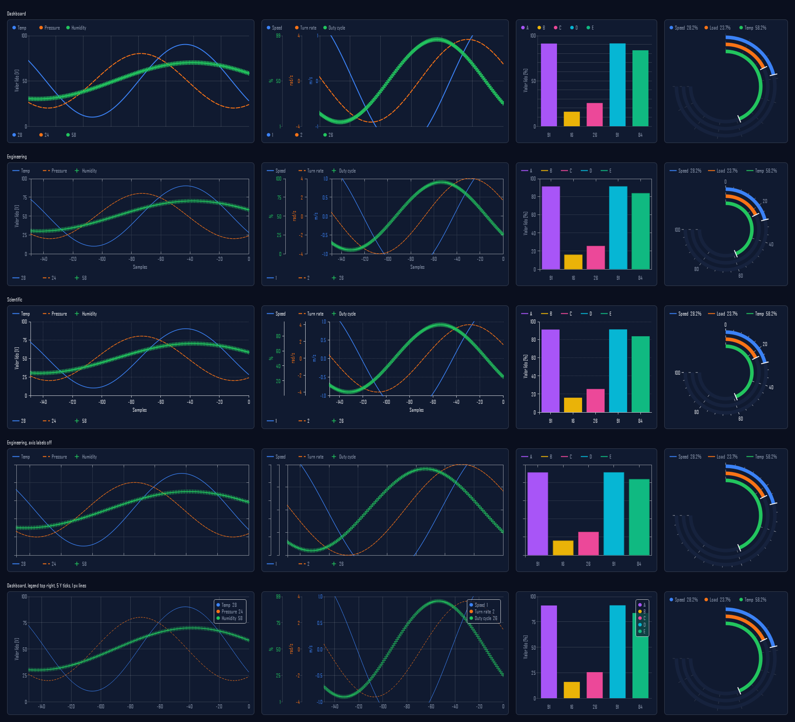

# Chart style guide

Every TraceView chart (line, bar, gauge, and any chart added later) draws
its axes, grid, frame, ticks and legend from one shared **style sheet**,
[lib/dashboard/widgets/chartstyle.h](../lib/dashboard/widgets/chartstyle.h).
It uses one shared set of **paint building blocks** to do it,
[lib/dashboard/widgets/chartpainting.h](../lib/dashboard/widgets/chartpainting.h).
A chart kind only draws what is truly its own, such as its series shapes.
Two charts in the same style therefore look like one family, and a new
chart gets all three styles, both themes and the gear-menu toggles
without extra work.

This page is the manual: which styles exist, what they are made of, how a
chart is laid out and painted, and the checklist for adding a chart kind or
a style.





## The three styles

Picked app-wide from **View → Chart Style** (also Settings → Appearance),
stored in `AppSettings::chartStyleId()` (`QSettings` key
`appearance/chartStyle`, default **Dashboard**). This is the same idea as
**View → Palette**, which only swaps colors. Every chart follows the app-wide
style while its own gear menu's **Style:** is left at **App default**, which
is the default for new charts and for dashboards saved before styles
existed. Picking a style there pins that one chart to it.

| | Dashboard | Engineering | Scientific |
|---|---|---|---|
| Idea | The original TraceView look | Lab instrument, MATLAB-like | Publication, matplotlib-like |
| Frame (`frame`) | `Ruler`: a spine per value axis, shown with the grid | `Box`: all four edges | `Spines`: left and bottom |
| Ticks (`ticks`) | `Divisions`: min/mid/max labels | `Nice`: round numbers | `Nice`: round numbers |
| Tick direction | Outward, 4 px | X inward, 5 px, mirrored on right/top | Outward, 4 px |
| Y axis ticks | Left, toward the numbers (every style, every axis) | same | same |
| Origin corner | - | One outward tick per axis | One outward tick per axis |
| Auto range | 5% headroom | Snapped to the outer ticks, no margin | 5% margin, not snapped |
| Grid | Solid, `palette.border` | Solid, 12% text over surface | Dotted, 30% text over surface |
| Frame color | `palette.border` | 55% text over surface | 80% text over surface |
| Labels | `textSecondary` | `textSecondary` | `textPrimary` |
| Series line (when "Line width" is Auto) | 2 px | 1.25 px | 1.5 px |
| Bars | 70% of slot, no outline | 80% of slot, darker outline | 80% of slot, no outline |
| Legend swatch | Dot | Line sample in the series' dash | Line sample in the series' dash |
| Digits | Proportional | Tabular (`tnum`) | Tabular (`tnum`) |
| Axis toggles for a saved view that names only the style | Y title, Y values | All | All |

The table is the `makeDashboardStyle()` / `makeEngineeringStyle()` /
`makeScientificStyle()` functions in `chartstyle.cpp`. Change a value there
and every chart kind follows.

## Where things live

| File | What it owns |
|---|---|
| `widgets/chartscale.h` | Pure tick math: `niceScale()` (1/2/2.5/5 × 10ⁿ steps), `tickDecimals()`, `formatTick()`, `maxTicksFor()`. No Qt widgets. |
| `widgets/chartstyle.h` | The style tokens (`ChartStyle`), colors (`chartColors()`), the range rules (`AxisRange`, `valueScale()`, `timeAxisScale()`, `seriesDataRange()`), and the per-widget view state (`ChartViewOptions`, its JSON and its gear-menu option list). Pure, no painting. |
| `widgets/chartpainting.h` | Paint building blocks: background, legend rows and swatches, the cartesian layout (`layoutCartesianChart()`) and axes (`paintCartesianAxes()`), crisp lines, markers. |
| `widgets/chartwidgets.h` | The chart kinds. `StyledChartWidget` is the common base (pause, repaint throttle, view state, gear menu). `ChartWidgetBase` adds series buffers and the clickable legend for series-over-X charts. |
| `dashboard/widgetviewoption.h` | The generic gear-menu entry `DashboardCell` renders. It knows nothing about charts. |

Unit tests: `tests/test_chartscale.cpp`, `tests/test_chartstyle.cpp`.

## Rules

1. **No look in literals.** A chart's paint code never picks a color, pen
   width, tick length or grid pattern itself. It reads `ChartStyle` and
   `ChartColors`. Series colors are the exception, since they belong to the
   series config.
2. **Colors come from the theme.** `chartColors()` mixes `textPrimary` into
   `surface` by a strength token, so every style works in every theme (see
   [THEMING.md](THEMING.md)). Never hard-code RGB.
3. **Ticks come from `valueScale()`/`niceScale()`.** Tick labels go through
   `formatTick()`, which never prints `-0`. Nice ticks print as many
   decimals as their step needs. Divisions ticks use the chart's own
   `decimals` setting.
4. **Ranges know their source.** An `AxisRange` is `Data` (scanned from
   samples: a style may add margin or snap it), `Declared` (the device's
   declared field range) or `Fixed` (the user's range). `Declared` and
   `Fixed` are never widened. `Empty` is a placeholder 0..1.
5. **Labels force round ticks.** An axis in `Divisions` mode (a Dashboard
   X axis, a Dashboard gauge) switches to nice ticks as soon as its labels
   are shown, because a label at an arbitrary fraction prints an awkward
   number.
6. **1 px chrome is crisp.** Grid, frame and tick lines go through
   `crispCoord()`, so antialiasing doesn't smear them across two pixels.
7. **Series are clipped to the plot.** A fixed range narrower than the data
   must not paint over the axis labels.

## Anatomy of a cartesian chart

`layoutCartesianChart()` reserves every margin before anything is painted.
It works in the only order without a circular dependency: vertical margins,
then plot height, Y ticks, Y label widths, plot width, X ticks, and finally
the right margin.

```
┌──────────────────────────────────────────────────────────┐
│ pad                                                      │
│ ● Temp  ● Pressure            ← legend row (names)       │
│ pad                                                      │
│ ┊title┊labels┊tick┊┌──────────── plotRect ───────────┐   │
│ ┊ (Y) ┊ 100  ┊   ─┤                                  │pad│
│ ┊     ┊  50  ┊   ─┤        series (clipped)          │   │
│ ┊     ┊   0  ┊   ─┤                                  │   │
│               └──┬─────────┬──────────┬──────────┘       │
│                -100       -50         0   ← X tick labels │
│                        Samples            ← X title       │
│ pad                                                      │
│ ● 28   ● 24                        ← legend row (values)  │
│ pad                                                      │
└──────────────────────────────────────────────────────────┘
```

- **Stacked Y axes** (`ChartConfig::autoAxis`, one per unit): axis 0 is the
  primary. It sits on the plot edge and is the only one that draws
  gridlines. Each further axis stands one axis-width to the left, with its
  own spine and ticks, plus a 10 px gap, so its labels never touch the
  next spine even with the axis titles hidden. When there is more than one
  axis, each is tinted in its first series' color.
- **X axis of a line chart** runs from the oldest sample slot to "now" at
  `0`: `[-(capacity-1), 0]` samples, or the same span in seconds in Time
  mode (`timeAxisScale()`). It matches the series' own pixel placement, so
  ticks sit exactly under the samples they label.
- **Free sides** (top and right, or any side without a legend row or X
  axis band) get the padding plus the half of the edge tick label that
  sticks out past the plot, so the plot doesn't look pushed against them
  while the labeled sides look roomy.
- **Legend rows** above and below the plot exist only while the legend is
  "Outside the plot". With the legend in a corner or hidden, neither row is
  reserved and the plot takes the room. A corner legend
  (`paintChartInsetLegend()`) is a box inside the plot, one row per series
  ("name  value" while "Show last value" is on), on `palette.surface` at the
  "Legend background" opacity with a frame-colored outline at the same
  opacity. Rows that don't fit the plot height are left out, and text is
  only elided when the plot is narrower than the box.
- **Y axis ticks** (gear menu): Auto follows the style (min/mid/max for
  Dashboard, as many round ticks as the height allows for the others). A
  number N splits a Dashboard axis into N-1 equal parts and labels them all,
  using enough decimals to tell neighbors apart. For the Nice styles N is
  the tick budget.

### Paint order

1. `paintChartBackground()`
2. `paintCartesianAxes()`: grid, then frame, then Y axes (spine, ticks,
   labels, rotated title), then the X axis (ticks, labels, title).
   Labels that would collide are skipped.
3. The chart's own series, clipped to `plotRect`.
4. Grid point values.
5. Legends (`paintChartLegendRow()` or `paintChartInsetLegend()`), which
   also record the click targets. A corner legend sits over the series.
6. Hover crosshair and its balloon, over everything.

## View state and the gear menu

Each chart widget keeps a `ChartViewOptions`: the style plus every gear
toggle. It is stored in the widget's config under `"view"`:

```json
"config": {
  "yAxis": { "...": "..." },
  "series": [],
  "view": {
    "style": "engineering",
    "xAxisTitle": true, "xTickLabels": true,
    "yAxisTitle": true, "yTickLabels": true,
    "scaleLabels": true,
    "lastValue": true, "gridPoints": false, "hoverCrosshair": false,
    "interpolation": "linear",
    "legend": "topRight", "legendOpacity": 75,
    "yTicks": 0, "lineWidth": 0
  }
}
```

- `"style": "app"` (or no style at all) follows the app-wide chart style;
  `StyledChartWidget::effectiveStyle()` resolves it at paint time and
  charts repaint when `AppSettings::chartStyleChanged()` fires.
- A missing key takes the style's default (axis toggles) or the struct
  default (everything else), so an old dashboard looks exactly as before.
  A numeric value outside the menu's choices snaps to the nearest choice.
- Every option is independent. Picking a style changes how things are drawn,
  never which things are shown, the same as switching the app theme.
- The menu stays open while options are flipped (`StickyMenu` in
  `dashboardcell.cpp`), so several can be changed in one visit.
- The gear menu is generic. The widget returns its options from
  `DashboardWidget::viewOptions()`. `DashboardCell` draws them (a checkable
  action per toggle, a select box per choice) and hands every change to
  `viewConfigWith()` and then `setViewConfig()`.
  `DashboardGrid::handleViewConfigChanged()` stores the result through the
  undo stack, so it is saved with the project and undone with Ctrl+Z.
- The properties panel editors rebuild a widget's config without `"view"`.
  `DashboardGrid::changeSelectedConfig()` carries the current `"view"` over,
  so editing a series never resets the style.

| Option id | Menu label | Offered by |
|---|---|---|
| `style` | Style: App default, Dashboard, Engineering, Scientific | every chart |
| `xAxisTitle` | Show X axis title | line, audio |
| `xTickLabels` | Show X axis values | line, audio |
| `yAxisTitle` | Show Y axis title | line, bar, audio |
| `yTickLabels` | Show Y axis values | line, bar, audio |
| `yTicks` | Y axis ticks: Auto, 3, 5, 6, 11 | line, bar, audio (spectrum) |
| `legend` | Legend: Outside the plot, a corner, Hidden | line, bar |
| `legendOpacity` | Legend background: 0 to 100% | line, bar |
| `scaleLabels` | Show scale values | gauge |
| `lastValue` | Show last value | line (values row), bar (value under each bar) |
| `gridPoints` | Show grid point values | line |
| `hoverCrosshair` | Show hover crosshair | line, audio |
| `info` | Show info row (live readouts above the plot) | line, audio |
| `infoItems` | Info row values (a submenu, any number): sample rate, samples in window, window span; minimum, maximum, peak to peak, peak, mean, median, RMS | line, audio |
| `markers` | Range markers (A/B) | line, audio (spectrogram) |
| `fillArea` | Fill area under the line | line, audio (spectrum) |
| `lineWidth` | Line width: Auto, 0.5 to 4 px | line, audio (spectrum) |
| `interpolation` | Interpolation: | line |
| `gaugeShape` | Shape: Ring (270°), Half circle, Bar, Number | gauge |

"audio" is the Audio Analyzer (`AudioAnalyzerWidget`), whose `mode` option
("View:", first in its menu) switches between `spectrum` and
`spectrogram`; the menu then offers only that view's options. It starts
with `xTickLabels`, `info` and `fillArea` on when its saved view has no
value for them, and adds options of its own to the same `"view"` object:
`play`, `fft`, `axis` (log/linear frequency), then `peak` and `scale`
(dBFS/linear amplitude) for the spectrum, `history`, `floor`, `colors` and
`colorScale` for the spectrogram. The info row
(`paintChartInfoRow()`) draws each number right-aligned in a slot as wide as
its widest value, in equal-width digits, so it never shifts.

On the line chart, `infoItems` holds the picked values in menu order. The
window readouts share one row; each statistic gets a column on one row per
shown series (color dot and name first). With `markers` on, two dashed
lines A and B, dragged by their lettered tabs, bound the samples the
statistics are taken from, and the window row adds the A-B span; with them
off, the statistics cover the whole window. The markers sit at a fixed
distance from the newest sample, so the data scrolls through them; their
positions are not saved. `seriesStatistics()` (chartdata.h) does the math.
The Audio Analyzer offers the values in both views and the markers in the
spectrogram, over its time axis. Its statistics describe the audio signal
itself on a second info row: minimum,
maximum, peak to peak, mean and median in full-scale units (1.0 = full
scale), peak and RMS in dBFS. Each column keeps a summary of the samples it
covers (min, max, sum, sum of squares, median), so everything but the
median is exact over any span of columns; the median is the median of the
columns' medians (the spectrogram's columns keep running in the spectrum
view too). Its window row shows the samples and seconds the history covers.

A multi-choice option is drawn as a sticky submenu of checkable entries
(`WidgetViewOption::Kind::MultiChoice`).

Two app-wide appearance choices also reach every chart, see "Appearance" in
[VISUAL_IDENTITY.md](VISUAL_IDENTITY.md):

- **Data colors** resolve each series' color through
  `ThemeManager::seriesColor()`. A chart kind with series implements
  `refreshDataColors()` and keeps its configured colors apart.
- **Motion**: a value a chart animates (gauge needle, bar height) goes
  through `StyledChartWidget::easedValues()`, never its own timer, so
  "Reduced" motion turns every animation off at once.

## Adding a chart kind

1. **Pick a base.** Series plotted over a continuous X or a category axis:
   derive from `ChartWidgetBase`, which gives you buffers, `seriesAxes()`,
   `paintLegends()` and the clickable legend. Anything else (dials, maps,
   heatmaps): derive from `StyledChartWidget`, which gives you pause, the
   repaint throttle and the view state.
2. **Declare your gear options** in `viewFeatures()`. Only offer what your
   paint code actually honors.
3. **Parse the view** by calling `applyViewFromConfig(config)` at the end of
   your `setConfig()`.
4. **Paint with the building blocks.** Start from
   `chartStyle(m_view.style)` and `chartColors(style, palette)`. For a
   cartesian chart, call `layoutCartesianChart()` and
   `paintCartesianAxes()`, then draw your series inside
   `layout.plotRect`, mapping values with `chartValueToX()` and
   `chartValueToY()`. For anything else, still build your scale with
   `valueScale()`/`niceScale()`, your labels with `chartTickFont()` and
   `formatTick()`, and your legend with `chartLegendColumns()` and
   `paintChartLegendRow()`. The gauge is the worked example of a
   non-cartesian chart.
5. **If a style needs a new knob** (for example "pie slice gap"), add a
   token to `ChartStyle` with the Dashboard value as its default, and set
   it in the other styles' `make...Style()`. Don't branch on
   `style.id` in paint code.
6. **Register the widget** as in [DASHBOARD.md](DASHBOARD.md#adding-a-new-widget-type)
   and add it to `tools/chart_preview` (below). Check it in all three
   styles and at least one light and one dark theme.

## Adding a style

1. Add an id to `ChartStyleId`, and a case to `chartStyleIdString()`,
   `chartStyleFromId()`, `chartStyleDisplayName()` and `allChartStyles()`.
2. Write its `make...Style()` in `chartstyle.cpp` and return it from
   `chartStyle()`.
3. Translate its display name (context `ChartStyle`) in every
   `translations/*.ts`.
4. Run the preview and add a row to the table above.

## Previewing

`tools/chart_preview` (built with `-DTRACEVIEW_BUILD_TOOLS=ON`) opens a
window with live synthetic data. With `--snapshot <dir>` it instead writes
one contact sheet per theme, `<dir>/charts-<theme>.png`, with every chart
kind in every style, plus a row with every axis label switched off and one
with a corner legend, 5 Y ticks and 1 px lines. It
needs no desktop:

```powershell
$env:QT_QPA_PLATFORM = "offscreen"
$env:QT_QPA_FONTDIR  = "C:\Windows\Fonts"   # otherwise text renders as boxes
chart_preview.exe --snapshot out
```

The screenshots at the top of this page come from that command.
